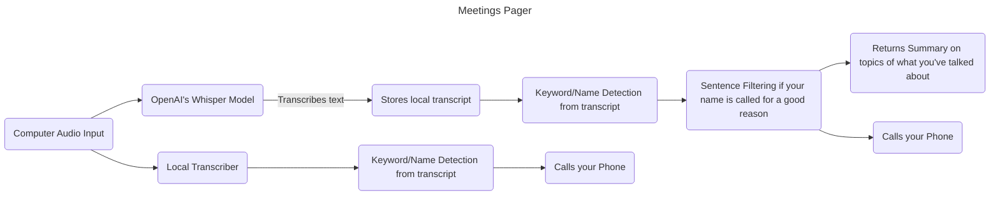

# Documentation

## Getting Started

### Twilio Setup

#### Prerequisites
Make sure you have Twilio installed by running the command:
```
pip install twilio
```

#### Getting Your Twilio Phone Number
You can get your Twilio phone number by following these steps or by watching this [YouTube Video](https://www.youtube.com/watch?v=Sqsz2T1Bzlg&t=29s).

1. Go to the [Twilio Website](https://www.twilio.com/en-us)
2. Create a new account by clicking the sign-up button in the top right corner
3. Verify your phone number through the signup process
4. Verify your email address
5. Complete the survey questions according to your preferences
6. On your account dashboard, click on "Get a Twilio phone number"
7. Scroll down to find the Account Info tab
8. Expand the tab to locate your:
   - Account SID
   - Auth Token
   - My Twilio Phone Number
9. Copy and paste these credentials into the website


## Development Docs
### Functionality Chart



### Folders/Files
```
├── main.py                 # Main execution of the functions toether
├── docs                    # Documentation files (alternatively `doc`)
├── Components              # Components of the pager
│   ├── call_component.py   # Number Calling Functionality
│   ├── gui_component.py    # Python Gui Maker
├── Images/                 # Miscellaneous Images
└── ...
```